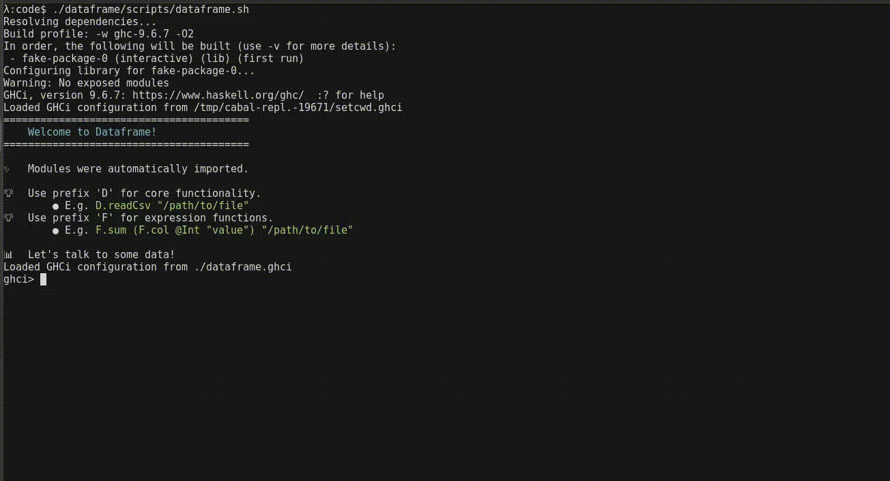

<h1 align="center">
  <a href="https://dataframe.readthedocs.io/en/latest/">
    
  </a>
</h1>

<div align="center">
  <a href="https://hackage.haskell.org/package/dataframe-0.2.0.2">
    
  </a>
</div>

<p align="center">
  <a href="https://dataframe.readthedocs.io/en/latest/">User guide</a>
  |
  <a href="https://discord.gg/XJE5wKT2kb">Discord</a>
</p>

# DataFrame

A fast, safe, and intuitive DataFrame library.

## Why use Haskell?

* Having types around eliminates many kinds of bugs before you even run the code.
* A highly composable programming model that makes it easy to write pipelines.
* The Haskell compiler does a lot of optimization that makes code very fast.
* The syntax is more approachable than other compiled languages' dataframes.

## Installing

### Jupyter notebook
* We have a [hosted version of the Jupyter notebook](https://ihaskell-dataframe-crf7g5fvcpahdegz.westus2-01.azurewebsites.net/lab/) on azure sites.
* Use the Dockerfile in the [ihaskell-dataframe](https://github.com/mchav/ihaskell-dataframe) to build and run an image with dataframe integration.
* For a preview check out the [California Housing](https://ihaskell-dataframe-crf7g5fvcpahdegz.westus2-01.azurewebsites.net/lab/tree/California%20Housing.ipynb) notebook.

### CLI
* Install Haskell (ghc + cabal) via [ghcup](https://www.haskell.org/ghcup/install/) selecting all the default options.
* Install snappy (needed for Parquet support) by running: `sudo apt install libsnappy-dev`.
* To install dataframe run `cabal update && cabal install dataframe`
* Open a Haskell repl with dataframe loaded by running `cabal repl --build-depends dataframe`.
* Follow along any one of the tutorials below.


## What is exploratory data analysis?
We provide a primer [here](https://github.com/mchav/dataframe/blob/main/docs/exploratory_data_analysis_primer.md) and show how to do some common analyses.

## Coming from other dataframe libraries
Familiar with another dataframe library? Get started:
* [Coming from Pandas](https://github.com/mchav/dataframe/blob/main/docs/coming_from_pandas.md)
* [Coming from Polars](https://github.com/mchav/dataframe/blob/main/docs/coming_from_polars.md)
* [Coming from dplyr](https://github.com/mchav/dataframe/blob/main/docs/coming_from_dplyr.md)

## Example usage

### Code example
```haskell
{-# LANGUAGE OverloadedStrings #-}
{-# LANGUAGE TypeApplications #-}
import qualified DataFrame as D
import qualified DataFrame.Functions as F

import DataFrame ((|>))

main :: IO ()
main = do
    df <- D.readTsv "./data/chipotle.tsv"
    print $ df
      |> D.select ["item_name", "quantity"]
      |> D.groupBy ["item_name"]
      |> D.aggregate [ (F.sum @Int "quantity")     `F.as` "sum_quantity"
                     , (F.mean "quantity")         `F.as` "mean_quantity"
                     , (F.maximum @Int "quantity") `F.as` "maximum_quantity"
                     ]
      |> D.sortBy D.Descending ["sum_quantity"]
      |> D.take 10
```

Output:

```
------------------------------------------------------------------------------------------
index |          item_name           | sum_quantity |    mean_quanity    | maximum_quanity
------|------------------------------|--------------|--------------------|----------------
 Int  |             Text             |     Int      |       Double       |       Int      
------|------------------------------|--------------|--------------------|----------------
0     | Chicken Bowl                 | 761          | 1.0482093663911847 | 3              
1     | Chicken Burrito              | 591          | 1.0687160940325497 | 4              
2     | Chips and Guacamole          | 506          | 1.0563674321503131 | 4              
3     | Steak Burrito                | 386          | 1.048913043478261  | 3              
4     | Canned Soft Drink            | 351          | 1.1661129568106312 | 4              
5     | Chips                        | 230          | 1.0900473933649288 | 3              
6     | Steak Bowl                   | 221          | 1.04739336492891   | 3              
7     | Bottled Water                | 211          | 1.3024691358024691 | 10             
8     | Chips and Fresh Tomato Salsa | 130          | 1.1818181818181819 | 15             
9     | Canned Soda                  | 126          | 1.2115384615384615 | 4 
```

Full example in `./app` folder using many of the constructs in the API.

### Visual example


## Supported input formats
* CSV
* Apache Parquet (still buggy and experimental)

## Future work
* Apache arrow compatability
* Integration with common data formats (currently only supports CSV)
* Support windowed plotting (currently only supports ASCII plots)
* Host the whole library + Jupyter lab on Azure with auth and isolation.

## Contributing
* Please first submit an issue and we can discuss there.
